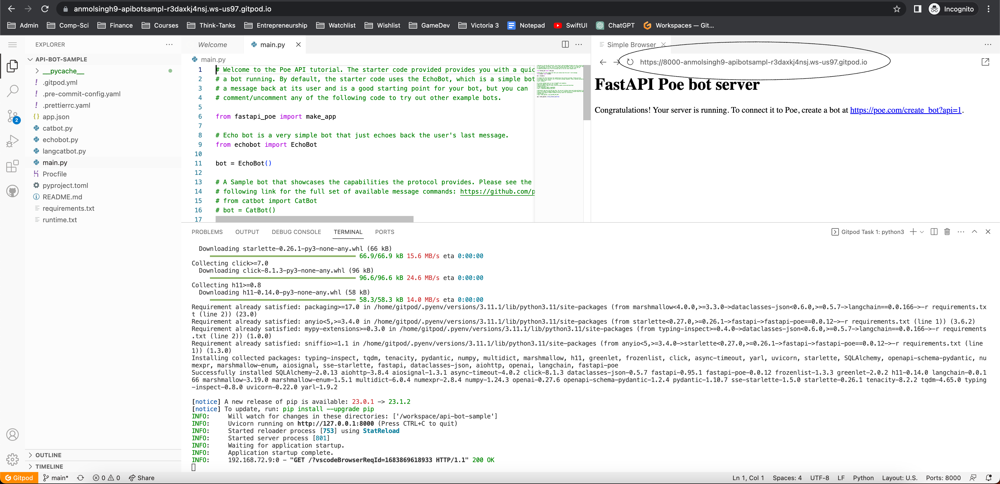

# API Bot tutorial

Welcome to the Poe API Bot tutorial. This repository includes starter code and will help
you quickly get a bot running. As part of this tutorial, we will go over how to deploy
this starter code and how to integrate your bot server with poe. For more information on
Poe API bots, see [poe-protocol](https://github.com/poe-platform/poe-protocol).

## Deploying your bot

We will go over three ways of deploying your bot.

- Using `Gitpod`, a cloud-based IDE (this method is the fastest).
- Using `ngrok` (allows you to make public a bot running on your local computer).
- Using a cloud provider like Heroku (most scalable but the most amount of work).

### Gitpod

[Gitpod](https://gitpod.io/) is a browser-based IDE. Among other features, it allows you
to run a publicly accessible Web service as part of your project. To get started:

- Go to [gitpod.io/workspaces](https://gitpod.io/workspaces) and login or create an
  account.
- Click "New Workspace".
- Enter the address of this repo (i.e.,
  https://github.com/poe-platform/api-bot-tutorial) into the "Context URL" field.
- Hit continue. Gitpod will now take a few minutes to spin up the new workspace and
  start your server.
- Note the URL in the address bar above "FastAPI Poe bot server" (see screenshot).
  - 
  - This is your bot server URL

### ngrok

[ngrok](https://ngrok.com/) is a tool to add Internet connectivity to any service. You
can use it, for example, to make a Poe bot running on your local computer accessible on
the Internet:

- Install ngrok ([instructions](https://ngrok.com/download))
- Open a terminal and run:
  - `git clone https://github.com/poe-platform/api-bot-tutorial`
  - `cd api-bot-tutorial`
  - `pip install -r requirements.txt`
- Start your bot server using `uvicorn main:app --reload`
- Confirm that it is running locally by running `curl localhost:8000`
- Run `ngrok http 8000` in another terminal and note the URL it provides, which will
  look like `https://1865-99-123-141-32.ngrok-free.app`
- Access that URL in your browser to confirm it works. This is your bot server URL.

### Heroku

[Heroku](https://heroku.com) is a cloud platform that makes it easy to deploy simple
apps.

- Create an account on [heroku.com](https://heroku.com)
- On the website, create a new application. Let's name it $YOUR_APP
- [Install](https://devcenter.heroku.com/articles/heroku-cli#install-the-heroku-cli) the
  Heroku CLI
  - Login using `heroku login`
- Open the [bot creation page](https://poe.com/create_bot?api=1). An API key will be
  pre-generated for you.
- Open a terminal and run:
  - `git clone https://github.com/poe-platform/api-bot-tutorial`
  - `cd api-bot-tutorial`
  - `heroku git:remote -a $YOUR_APP`
  - `heroku config:set POE_API_KEY=$POE_API_KEY`, where `$POE_API_KEY` is the API key
    you got from [bot creation page](https://poe.com/create_bot?api=1)
  - `git push heroku main`
- Now your app should be online at `https://$YOUR_APP.herokuapp.com/`. This is your bot
  server URL.

## Integrating with Poe

Once you have a bot running under a publicly accessible URL, it is time to connect it to
Poe. You can do that on poe.com at
[the bot creation form](https://poe.com/create_bot?api=1). You can also specify a name
and description for your bot. After you fill out the form and click "create bot", your
bot should be ready for use in all Poe clients!

## Where to go from here

- The starter code by default uses the EchoBot which is a simple bot with no AI
  capabilities. You can comment/uncomment any of the other example bots to try them out
  or build off of them.
- Refer to [poe-protocol](https://github.com/poe-platform/poe-protocol) to understand
  the full capabilities offered by Poe API bots and see some additional tools and
  samples, including:
  - The [specification](https://github.com/poe-platform/poe-protocol/blob/main/spec.md)
    that details precisely how API bots work
  - The [fastapi-poe](https://pypi.org/project/fastapi-poe/) library, which you can use
    as a base for creating Poe bots

## Questions?

Join us on [Discord](https://discord.gg/TKxT6kBpgm) with any questions.
